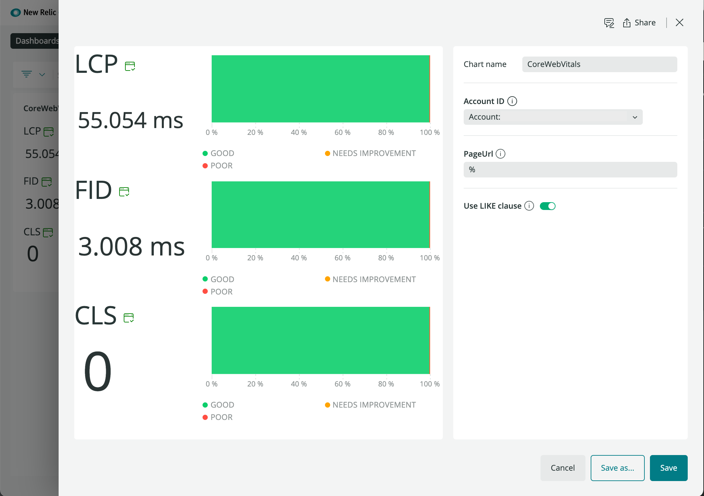

# core-web-vitals

Visualization for NewRelicOne to show Core Web Vitals.


## Getting started

Run the following scripts:

```
npm install
npm start
```

Visit https://one.newrelic.com/?nerdpacks=local and :sparkles:


